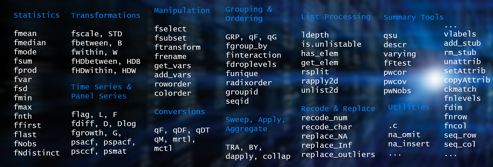

In [*previous posts*](<https://sebkrantz.github.io/Rblog/>) I introduced [*collapse*](https://sebkrantz.github.io/collapse/), a powerful (C/C++ based) new framework for data transformation and statistical computing in R - providing advanced grouped, weighted, time series, panel data and recursive computations in R at superior execution speeds, greater flexibility and programmability. 

<!--  up to 20x faster than the popular *data.table* package -->

*collapse* 1.4 released this week additionally introduces an enhanced attribute handling system which enables non-destructive manipulation of vector, matrix or data frame based objects in R. With this post I aim to briefly introduce this attribute handling system and demonstrate that:

1. *collapse* non-destructively handles **all** major matrix (time series) and data frame based classes in R.

2. Using *collapse* functions on these objects yields uniform handling at higher computation speeds. 

```{r setup, include=FALSE}
knitr::opts_chunk$set(collapse = TRUE, fig.width = 8, fig.height = 5, out.width = '100%', cache = FALSE, message = FALSE, warning = FALSE, error = FALSE)

oldopts <- options(width = 101L)

library(data.table)
```

# Data Frame Based Objects
The three major data frame based classes in R are the base R *data.frame*, the *data.table* and the *tibble*, for which there also exists grouped (*dplyr*) and time based (*tsibble*, *tibbletime*) versions. Additional notable classes are the panel data frame (*plm*) and the spatial features data frame (*sf*). 

For the former three *collapse* offer extremely fast and versatile converters `qDF`, `qDT` and `qTBL` that can be used to turn many R objects into *data.frame*'s, *data.table*'s or *tibble*'s, respectively:

```{r}
library(collapse); library(data.table); library(tibble)
options(datatable.print.nrows = 10, 
        datatable.print.topn = 2)

identical(qDF(mtcars), mtcars)

mtcarsDT <- qDT(mtcars, row.names.col = "car")
mtcarsDT

mtcarsTBL <- qTBL(mtcars, row.names.col = "car")
print(mtcarsTBL, n = 3)
```

These objects can then be manipulated using an advanced and attribute preserving set of (S3 generic) statistical and data manipulation functions. The following infographic summarizes the core *collapse* namespace: 



More details are provided in the freshly released [*cheat sheet*](<https://raw.githubusercontent.com/SebKrantz/cheatsheets/master/collapse.pdf>), and further in the [*documentation*](<https://sebkrantz.github.io/collapse/reference/index.html>) and [*vignettes*](<https://sebkrantz.github.io/collapse/articles/index.html>).

<!--

The following graphic summarized the core fun `fselect(<-)`, `fsubset`, `(f/set)transform(<-)`, `fgroup_by`, `(f/set)rename`, `roworder`, `colorder`, `funique` `get_vars`, `(type)_vars`, `add_vars`, `na_omit`, etc.., as well as full sets of fast generic statistical and data transformation functions (supporting vectors, matrices and data frames) and further specialized functions.
-->


<!-- ```{r} -->
<!-- # Macro storing names of collapse fast functions for statistical computation and data transformation -->
<!-- .FAST_FUN  -->
<!-- # Some additional convenience operators for data transformations -->
<!-- .OPERATOR_FUN -->
<!-- # Also relevant: Aggregating, sweeping, row-and column apply -->
<!-- .c(collap, BY, TRA, dapply) -->
<!-- # Recode and replace values -->
<!-- .c(recode_num, recode_char, replace_NA, replace_Inf, replace_outliers) -->
<!-- ``` -->

The statistical functions internally handle grouped and / or weighted computations on vectors, matrices and data frames, and seek to keep the attributes of the object. 

```{r}
# Simple data frame: Grouped mean by cyl -> groups = row.names  
fmean(fselect(mtcars, mpg, disp, drat), g = mtcars$cyl)
```
With `fgroup_by`, collapse also introduces a fast grouping mechanism that works together with *grouped_df* versions of all statistical and transformation functions: 

```{r}
# Using Pipe operators and grouped data frames
library(magrittr)
mtcars %>% fgroup_by(cyl) %>% 
  fselect(mpg, disp, drat, wt) %>% fmean  

# This is still a data.table 
mtcarsDT %>% fgroup_by(cyl) %>% 
  fselect(mpg, disp, drat, wt) %>% fmean

# Same with tibble: here computing weighted group means -> also saves sum of weights in each group
mtcarsTBL %>% fgroup_by(cyl) %>% 
  fselect(mpg, disp, drat, wt) %>% fmean(wt)

```

A specialty of the grouping mechanism is that it fully preserves the structure / attributes of the object, and thus permits the creation of a grouped version of any data frame like object. 
```{r}
# This created a grouped data.table
gmtcarsDT <- mtcarsDT %>% fgroup_by(cyl)
gmtcarsDT
# The print shows: [N. groups | Avg. group size (SD around avg. group size)]

# Subsetting drops groups 
gmtcarsDT[1:2]

# Any class-specific methods are independent of the attached groups
gmtcarsDT[, new := mean(mpg)]
gmtcarsDT[, lapply(.SD, mean), by = vs, .SDcols = -1L] # Again groups are dropped

# Groups are always preserved in column-subsetting operations
gmtcarsDT[, 9:13] 
```

The grouping is also dropped in aggregations, but preserved in transformations keeping data dimensions:
```{r}
# Grouped medians 
fmedian(gmtcarsDT[, 9:13])
# Note: unique grouping columns are stored in the attached grouping object 
# and added if keep.group_vars = TRUE (the default)

# Replacing data by grouped median (grouping columns are not selected and thus not present)
fmedian(gmtcarsDT[, 4:5], TRA = "replace")

# Weighted scaling and centering data (here also selecting grouping column)
mtcarsDT %>% fgroup_by(cyl) %>% 
  fselect(cyl, mpg, disp, drat, wt) %>% fscale(wt)
```

As mentioned, this works for any data frame like object, even a suitable list: 
```{r}
# Here computing a weighted grouped standard deviation
as.list(mtcars) %>% fgroup_by(cyl, vs, am) %>% 
  fsd(wt) %>% str
```

The function `fungroup` can be used to undo any grouping operation.

```{r}
identical(mtcarsDT,
          mtcarsDT %>% fgroup_by(cyl, vs, am) %>% fungroup)

```

Apart from the grouping mechanism with `fgroup_by`, which is very fast and versatile, *collapse* also supports regular grouped tibbles created with *dplyr*:

```{r}
library(dplyr)
# Same as summarize_all(sum) and considerably faster
mtcars %>% group_by(cyl) %>% fsum

# Same as muatate_all(sum)
mtcars %>% group_by(cyl) %>% fsum(TRA = "replace_fill") %>% head(3)

```

One major goal of the package is to make R suitable for (large) panel data, thus *collapse* also supports panel-data.frames created with the *plm* package:

```{r}
library(plm)
pwlddev <- pdata.frame(wlddev, index = c("iso3c", "year"))

# Centering (within-transforming) columns 9-12 using the within operator W()
head(W(pwlddev, cols = 9:12), 3)

# Computing growth rates of columns 9-12 using the growth operator G()
head(G(pwlddev, cols = 9:12), 3)

```

Perhaps a note about operators is necessary here before proceeding: *collapse* offers a set of transformation operators for its vector-valued fast functions:

```{r}
# Operators
.OPERATOR_FUN

# Corresponding (programmers) functions
setdiff(.FAST_FUN, .FAST_STAT_FUN)
```
These operators are principally just function shortcuts that exist for parsimony and in-formula use (e.g. to specify dynamic or fixed effects models using `lm()`, see the [documentation](<https://sebkrantz.github.io/collapse/reference/index.html>)). They however also have some useful extra features in the data.frame method, such as internal column-subsetting using the `cols` argument or stub-renaming transformed columns (adding a 'W.' or 'Gn.' prefix as shown above). They also permit grouping variables to be passed using formulas, including options to keep (default) or drop those variables in the output. We will see this feature when using time series below.

To round things off for data frames, I demonstrate the use of *collapse* with classes it was not directly built to support but can also handle very well. Through it's built in capabilities for handling panel data, *tsibble*'s can seamlessly be utilized:

```{r}
library(tsibble)
tsib <- as_tsibble(EuStockMarkets)

# Computing daily and annual growth rates on tsibble
head(G(tsib, c(1, 260), by = ~ key, t = ~ index), 3)

# Computing a compounded annual growth rate
head(G(tsib, 260, by = ~ key, t = ~ index, power = 1/260), 3)
```

Similarly for *tibbletime*:

```{r}
library(tibbletime); library(tsbox)
# Using the tsbox converter
tibtm <- ts_tibbletime(EuStockMarkets)

# Computing daily and annual growth rates on tibbletime
head(G(tibtm, c(1, 260), t = ~ time), 3)
# ...
```

Finally lets consider the simple features data frame:

```{r}
library(sf)
nc <- st_read(system.file("shape/nc.shp", package="sf"))

# Fast selecting columns (need to add 'geometry' column to not break the class)
plot(fselect(nc, AREA, geometry))

# Subsetting 
fsubset(nc, AREA > 0.23, NAME, AREA, geometry)

# Standardizing numeric columns (by reference)
settransformv(nc, is.numeric, STD, apply = FALSE)
# Note: Here using using operator STD() instead of fscale() to stub-rename standardized columns.
# apply = FALSE uses STD.data.frame on all numeric columns instead of lapply(data, STD)
head(nc, 2)
```
<!-- A salient feature of this class is the added 'geometry' column, so to select columns one has to also select this column to not break the class: -->

<!-- ```{r} -->
<!-- fselect(nc, NAME, AREA, geometry) %>% head(3) -->
<!-- ``` -->

# Matrix Based Objects

*collapse* also offers a converter `qM` to efficiently convert various objects to matrix:

```{r}
m <- qM(mtcars)
```
Grouped and / or weighted computations and transformations work as with with data frames:

```{r}
# Grouped means
fmean(m, g = mtcars$cyl)

# Grouped and weighted standardizing
head(fscale(m, g = mtcars$cyl, w = mtcars$wt), 3)
```

Various matrix-based time series classes such as *xts* / *zoo* and *timeSeries* are also easily handled:

```{r}
# ts / mts
# Note: G() by default renames the columns, fgrowth() does not
plot(G(EuStockMarkets))
# xts
library(xts) 
ESM_xts <- ts_xts(EuStockMarkets) # using tsbox::ts_xts
head(G(ESM_xts), 3)

plot(G(ESM_xts), legend.loc = "bottomleft")
# timeSeries
library(timeSeries) # using tsbox::ts_timeSeries
ESM_timeSeries <- ts_timeSeries(EuStockMarkets)
# Note: G() here also renames the columns but the names of the series are also stored in an attribute
head(G(ESM_timeSeries), 3)

plot(G(ESM_timeSeries), plot.type = "single", at = "pretty")
legend("bottomleft", colnames(G(qM(ESM_timeSeries))), lty = 1, col = 1:4)

```

Aggregating these objects yields a plain matrix with groups in the row-names:

```{r}
# Aggregating by year: creates plain matrix with row-names (g is second argument)
EuStockMarkets %>% fmedian(round(time(.)))

# Same thing with the other objects
all_obj_equal(ESM_xts %>% fmedian(substr(time(.), 1L, 4L)),
              ESM_timeSeries %>% fmedian(substr(time(.), 1L, 4L)))

```

# Benchmarks 
<!-- , particularly for `:=` transformations and weighted aggregations -->
Extensive benchmarks and examples against native *dplyr* / *tibble* and *plm* are provided [*here*](<https://sebkrantz.github.io/collapse/articles/collapse_and_dplyr.html#3-benchmarks>) and [*here*](<https://sebkrantz.github.io/collapse/articles/collapse_and_plm.html#benchmarks-1>), making it evident that *collapse* provides both greater versatility and massive performance improvements over the methods defined for these objects. Benchmarks against *data.table* were provided in a [*previous post*](<https://sebkrantz.github.io/Rblog/2020/08/31/welcome-to-collapse/>), where *collapse* compared favorably on a 2-core machine (particularly for weighted and `:=` type operations). In general *collapse* functions are extremely well optimized, with basic execution speeds below 30 microseconds, and efficiently scale to larger operations. Most importantly, they preserve the data structure and attributes (including column attributes) of the objects passed to them. They also efficiently skip missing values and avoid some of the undesirable behavior endemic of base R^[For example. `mean(NA, na.rm = TRUE)` gives `NaN`, `sum(NA, na.rm = TRUE)` gives `0` and `max(NA, na.rm = TRUE)` gives `-Inf` whereas `all_identical(NA_real_, fmean(NA), fsum(NA), fmax(NA))`. `na.rm = TRUE` is the default setting for all *collapse* functions. Setting `na.rm = FALSE` also checks for missing values and returns `NA` if found instead of just running through the entire computation and then returning a `NA` or `NaN` value which is unreliable and inefficient.]. 

Here I will add to the above resources just a small benchmark to prove that computations with *collapse* are also faster than any native methods and suggested programming principles for the various time series classes:

```{r}
library(dplyr) # needed for tibbletime / tsibble comparison    
library(microbenchmark)

# Computing the first difference
microbenchmark(ts = diff(EuStockMarkets),
               collapse_ts = fdiff(EuStockMarkets),
               xts = diff(ESM_xts),
               collapse_xts = fdiff(ESM_xts),
               timeSeries = diff(ESM_timeSeries),
               collapse_timeSeries = fdiff(ESM_timeSeries),
               # taking difference function from tsibble
               dplyr_tibbletime = mutate_at(tibtm, 2:5, difference, order_by = tibtm$time),
               collapse_tibbletime_D = D(tibtm, t = ~ time),
               # collapse equivalent to the dplyr method (tfmv() abbreviates ftransformv())
               collapse_tibbletime_tfmv = tfmv(tibtm, 2:5, fdiff, t = time, apply = FALSE),
               # dplyr helpers provided by tsibble package
               dplyr_tsibble = mutate(group_by_key(tsib), value = difference(value, order_by = index)),
               collapse_tsibble_D = D(tsib, 1, 1, ~ key, ~ index),
               # Again we can do the same using collapse (tfm() abbreviates ftransform())
               collapse_tsibble_tfm = tfm(tsib, value = fdiff(value, 1, 1, key, index)))

# Sequence of lagged/leaded and iterated differences (not supported by either of these methods)
head(fdiff(ESM_xts, -1:1, diff = 1:2)[, 1:6], 3) 
head(D(tibtm, -1:1, diff = 1:2, t = ~ time), 3)
head(D(tsib, -1:1, diff = 1:2, ~ key, ~ index), 3)

microbenchmark(collapse_xts = fdiff(ESM_xts, -1:1, diff = 1:2),
               collapse_tibbletime = D(tibtm, -1:1, diff = 1:2, t = ~ time),
               collapse_tsibble = D(tsib, -1:1, diff = 1:2, ~ key, ~ index))


```

# Conclusion 

This concludes this short demonstration. *collapse* is an advanced, fast and versatile data manipulation package. If you have followed until here I am convinced you will find it very useful, particularly if you are working in advanced statistics, econometrics, surveys, time series, panel data and the like, or if you care much about performance and non-destructive working in R. For more information about the package see the [*website*](<https://sebkrantz.github.io/collapse/index.html>), study the [*cheat sheet*](<https://raw.githubusercontent.com/SebKrantz/cheatsheets/master/collapse.pdf>) or call `help("collapse-documentation")` after install to bring up the built-in documentation. 

# Appendix: So how does this all actually work?

Statistical functions like `fmean` are S3 generic with user visible 'default', 'matrix' and 'data.frame' methods, and hidden 'list' and 'grouped_df' methods. Transformation functions like `fwithin` additionally have 'pseries' and 'pdata.frame' methods to support *plm* objects. 

The 'default', 'matrix' and 'data.frame' methods handle object attributes intelligently. In the case of 'data.frame's' only the 'row.names' attribute is modified accordingly, other attributes (including column attributes) are preserved. This also holds for data manipulation functions like `fselect`, `fsubset`, `ftransform` etc.. 'default' and 'matrix' methods preserve attributes as long as the data dimensions are kept. 

In addition, the 'default' method checks if its argument is actually a matrix, and calls the matrix method if `is.matrix(x) && !inherits(x, "matrix")` is `TRUE`. This prevents classed matrix-based objects (such as *xts* time series) not inheriting from 'matrix' being handled by the default method. 
