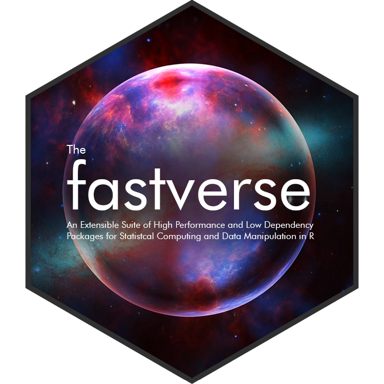

```{r setup, include=FALSE}
options(repos = c(CRAN = "https://cran.rstudio.com/"))
knitr::opts_chunk$set(collapse = TRUE)
```



The *fastverse* is a suite of complementary high-performance packages for statistical computing and data manipulation in R. Developed independently by various people, *fastverse* packages jointly contribute to the objectives of:

- Speeding up R through heavy use of compiled code (C, C++, Fortran)
- Enabling more complex statistical and data manipulation operations in R
- Reducing the number of dependencies required for advanced computing in R.

The `fastverse` package integrates, and provides utilities for easy installation, loading and management 
of such packages. It is an extensible framework that allows users to freely (and permanently) add or remove packages to create a 'verse' of packages suiting their general needs. Separate 'verses' can be created for different projects.

The package thus extends the functionality provided by the `tidyverse` package, whereas *fastverse* packages themselves are quite different from *tidyverse* packages to the extent that they 

1. Care less about having all data in tidy tibbbles but also support matrices and other objects 
2. Take R to the limits in terms of performance 
3. Don't require a lot of dependencies (if any) and 
4. Themselves implement and extend a lot of the statistical functionality found in `base` and `stats`. 

# Core Packages

The *fastverse* installs 6 core packages (*data.table*, *collapse*, *matrixStats*, *kit*, *magrittr* and *fst*) that are attached with `library(fastverse)`. These packages were selected because they provide high quality compiled code for most common statistical and data manipulation tasks, have carefully managed APIs, jointly depend only on base R and *Rcpp*, and work very well together. The functionality offered by these packages can be summarized as follows: 

- **data.table**: Enhanced data frame class with concise data manipulation framework offering powerful aggregation, extremely flexible split-apply-combine computing, reshaping, joins, rolling statistics, set operations on tables, fast csv read/write, and various utilities such as transposition of data. 

- **collapse**: Fast grouped & weighted statistical computations, time series and panel data transformations, list-processing, data manipulation functions, summary statistics and various utilities such as support for variable labels. Class-agnostic framework designed to work with vectors, matrices, data frames, lists and related classes i.e. *xts*, *data.table*, *tibble*, *pdata.frame*, *sf*.  <!-- *tsibble*, *tibbletime* -->

- **matrixStats**: Efficient row-and column-wise (weighted) statistics on matrices and vectors, including computations on subsets of rows and columns. 

- **kit**: Fast vectorized and nested switches, some parallel (row-wise) statistics, and some utilities such as efficient partial sorting and unique values. 

- **magrittr**: Efficient pipe operators for enhanced programming and code unnesting.

- **fst**: A compressed data file format that is very fast to read and write. Full random access in both rows and columns allows reading subsets from a '.fst' file. 

## *fastverse* Functions and Options

The package then offers several functions starting with `fastverse_` that help manage dependencies, detect namespace conflicts, add/remove packages from the *fastverse* and update packages: 

#### Functions to extend or reduce the number of packages in the *fastverse*

- `fastverse_extend()`
- `fastverse_detach()`
- `fastverse_reset()`

#### Function to display conflicts for *fastverse* packages

- `fastverse_conflicts()`

#### Function to update *fastverse* packages

- `fastverse_update()`

#### Utilities to retrieve the names of *fastverse* packages, their depenencies, and produce a situation report

- `fastverse_packages()`
- `fastverse_deps()`
- `fastverse_sitrep()`

#### Options

- `options(fastverse.quiet = TRUE)` disables all automatic messages (incl. conflict reporting).
- `options(fastverse.styling = FALSE)` disables all styling applied to text printed to the console. 
- `options(fastverse.extend = c(...))` contains names of packages used to extend the *fastverse*.


## Extending the *fastverse*
As mentioned already, a notable feature of the *fastverse* is that it is not a 'rigid' set of core packages, but can be extended or reduced, temporarily or permanently, globally or for specific projects, thus allowing you to create 'verses' of packages to your liking. 

### Extending for the Session

Let's say I have loaded the *fastverse* and I want to load additionally packages in my R session. I can do that with `fastverse_extend()`, which has the additional advantage that it checks for conflicts, and I can install any packages not available using `install = TRUE` before attaching them. 

```{r}
options(fastverse.styling = FALSE) # Disabling coloured output for this post
library(fastverse)

# Extending the fastverse for the session, installing packages if unavailable
fastverse_extend(fixest, robustbase, xts, roll, ggplot2, Rfast, install = TRUE)
```

These packages are now part of the *fastverse*. For example when generating a situation report they and (by default) their direct dependencies are included:

```{r}
# Generate situation report
fastverse_sitrep()
```

The packages are saved in `options("fastverse.extend")`. Detaching the *fastverse* does not (by default) remove packages from the option, but this can be changed with `fastverse_detach(..., session = TRUE)`:

```{r}
# Extensions are here
options("fastverse.extend")

# This detaches Rfast and roll, also removing them from options("fastverse.extend")
fastverse_detach(Rfast, roll, session = TRUE)
# This confirms that they were removed
fastverse_packages()
# Now detaching all packages
fastverse_detach()
# Attaching again includes extensions except for "Rfast" and "roll"
library(fastverse)

# This detaches all packages and clears all options
fastverse_detach(session = TRUE)
```

Note that it is also possible to extend the *fastverse* for the session by simply populating `options("fastverse.extend")` before calling `library(fastverse)`, but using `fastverse_extend()` is more secure, especially with option `install = TRUE`. 

## Permanent Extensions

`fasvtverse_extend()` and `fastverse_detach()` both have an argument `permanent = TRUE`, which can be used to make these changes persist across R sessions. This is implemented using a global configuration file saved to the package directory^[Thus it will be removed when the *fastverse* is reinstalled.]. 

For example, suppose most of my work involves time series analysis, and I would like to add *xts*, *zoo*, *roll*, and *dygraphs* to my *fastverse*. Let's say I also don't really use the *fst* file format, and I don't really need *matrixStats* either as I can do most of the time series statistics I need with base R and *collapse*. Let's finally say that I don't want `xts::first` and `xts::last` to mask `data.table::first` and `data.table::last`.

Then I could permanently modify my *fastverse* as follows^[I note that namespace conflicts can also be detected and handled with the [conflicted](<https://cran.r-project.org/package=conflicted>) package on CRAN.]: 

```{r}
options(fastverse.styling = FALSE)
library(fastverse)

# Adding extensions
fastverse_extend(xts, zoo, roll, dygraphs, permanent = TRUE)

# Removing some core packages
fastverse_detach(data.table, fst, matrixStats, permanent = TRUE)
# Adding data.table again, so it is attached last
fastverse_extend(data.table, permanent = TRUE)
```

Note that `options("fastverse.extend")` is still empty, because we have written those changes to a config file^[When fetching the names of *fastverse* packages, `fastverse_packages` first checks any config file and then checks `options("fastverse.extend")`.]. Now lets see if our permanent modification worked: 

```{r}
# detach all packages and clear all options
fastverse_detach(session = TRUE)
options(fastverse.styling = FALSE)
library(fastverse) 
```

After this permanent modification, the *fastverse* can still be extend for the session using `fastverse_extend()`. As long as the current installation of the *fastverse* is kept, these modifications will persist across R sessions, unless the config file is removed with `fastverse_reset()`. The *fastverse* also offers a more persistent mechanism to configure it inside projects:

## Custom *fastverse* Configurations for Projects

The *fastverse* gives you the ability to put together a custom collection of packages for a project and load and manage them with `library(fastverse)`.

To do this you need to include a configuration file named `.fastverse` (no file extension) inside a project directory, and place inside that file the names of packages to be loaded as core *fastvere*^[You can place package names in that file any manner you deem suitable: separated using spaces or commas, on one or multiple lines. Note that the file will be read from left to right and from top to bottom. Packages are attached in the order found in the file. Note that **all** packages to be loaded as core *fastverse* for your project need to be included in that file, in the order they should be attached.].    

Using a config file in a project will ignore any global configuration as discussed in the previous section. You can still extend the *fastverse* inside a project session using `fastverse_extend()` (or `options("fastvers.extend")` before `library(fastverse)`). 

## Suggested Extensions

The *fastverse* can be freely extended with any R package, but I have put together a list of suggested high-performance and low-dependency packages in the [README](<https://fastverse.github.io/fastverse/#suggested-extensions>) file. You are free to contribute to this list, so that it becomes a comprehensive showcase of R's high-performance world as far as statistical computing and data manipulation is concerned. 

## Installation: Versions of the *fastverse*

Currently, there are 2 different versions of the *fastverse* on CRAN and GitHub. The GitHub version is recommended if you want to have *matrixStats* consistently preserve attributes of your matrices: it modifies functions in the *matrixStats* namespace making them preserve attributes consistently (and by default) whenever the *fastverse* is attached^[The functions which are replaced are contained in a global variable `.matrixStats_replaced`, available in the GitHub version. Replacement happens whenever the *fastverse* is attached, regardless of whether *matrixStats* was attached before or is attached with the *fastverse*. Only if *matrixStats* is removed from the *fastverse* with `fastverse_detach(matrixStats, permanent = TRUE)` the functions will not be modified in the GitHub version.]. The CRAN version takes *matrixStats* as it is, which means most functions do not (by default) preserve attributes such as dimension names in computations. 

``` r
# Install the CRAN version
install.packages("fastverse")

# Install the GitHub version (Requires Rtools)
remotes::install_github("SebKrantz/fastverse")
```
*matrixStats* is slowly evolving towards greater consistency, but it might take more than half a year until dimension names are handled consistently by default - due to the large number of reverse dependencies. Until then CRAN and GitHub versions of the *fastverse* are released together. 

## Conclusion

The *fastverse* was developed principally for 2 reasons: to promote quality high-performance software development for R, and to provide a flexible approach to package loading and management in R, particularly for users wishing to combine various high-performance packages in statistical workflows. 

This post already introduced most of what there is to know about the *fastverse*. Additional details are found on the [website](<https://fastverse.github.io/fastverse/>). 

```{r}
# Resetting the fastverse to defaults (clearing all permanent extensions and options)
fastverse_reset()
# Detaching 
fastverse_detach()
```


