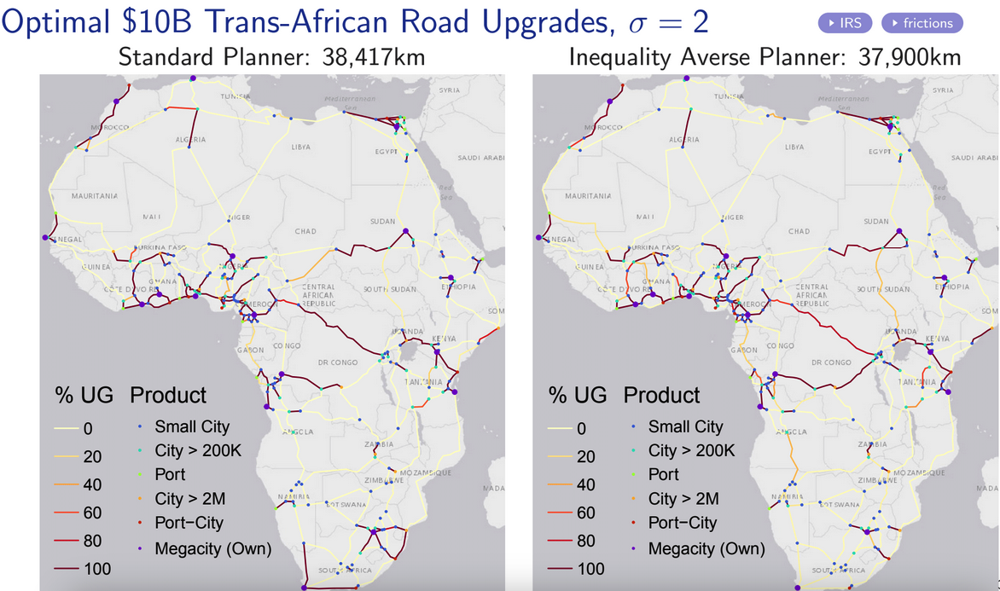

I'm happy to announce the release of [OptimalTransportNetworks.jl](https://github.com/OptimalTransportNetworks/OptimalTransportNetworks.jl), a modern Julia translation of the MATLAB [OptimalTransportNetworkToolbox](https://github.com/OptimalTransportNetworks/OptimalTransportNetworkToolbox) implementing the quantitative spatial model and algorithms described in 

Fajgelbaum, P. D., & Schaal, E. (2020). Optimal transport networks in spatial equilibrium. *Econometrica, 88*(4), 1411-1452.

The model/software uses duality principles to **optimize over the space of networks**, nesting an optimal flows problem and a neoclassical general-equilibrium trade model into a global network design problem to derive the optimal (welfare maximizing) transport network (extension) from any primitive set of economic fundamentals.^[Population per location, productivity per location for each of *N* traded goods, endowment of a non-traded good, and (optionally) a pre-existing transport network.]

For more information about the model see [this folder](https://github.com/OptimalTransportNetworks/OptimalTransportNetworkToolbox/tree/main/docs/paper_materials) and the [MATLAB User Guide](https://raw.githubusercontent.com/OptimalTransportNetworks/OptimalTransportNetworkToolbox/main/docs/User%20Guide.pdf). 

The model is the first of its kind and a pathbreaking contribution towards the welfare maximizing planning of transport infrastructure. Its creation has been funded by the European Union through an [ERC Research Grant](https://cordis.europa.eu/project/id/804095). 

## Example

The code for this example is in [example04.jl](https://github.com/OptimalTransportNetworks/OptimalTransportNetworks.jl/blob/main/examples/example04.jl). See the [examples folder](https://github.com/OptimalTransportNetworks/OptimalTransportNetworks.jl/blob/main/examples) for more examples.

This plot shows the endowments on a map-graph: circle size is population, circle colour is productivity (the central node is more productive), the black lines indicate geographic barriers, and the background is shaded according to the cost of network building (elevation), indicating a mountain in the upper right corner. 

The following plot shows the optimal network after 200 iterations, keeping population fixed. The size of nodes indicates consumption in each node. The blue lines are the proposed roads and their thickness indicates their capacity.^[Which is necessarily a continuous measure. We may also think in terms of of road speed, with "thicker" roads being the faster ones.]

You may wonder why are there multiple roads to certain cities? The reason is decreasing returns to infrastructure ($\beta \leq \gamma$, where $\beta$ governs the strength of congestion forces and $\gamma$ the returns to infrastructure). This guarantees the global convexity of the nested optimization problem. In this example $\beta = \gamma = 1$. 

However, we can assume increasing returns to infrastructure, e.g., by setting $\gamma = 2$. In this case the nested optimization problem is not globally convex, and the software automatically calls a Simulated Annealing algorithm to approximate the global solution following convex optimization. The result: 

  
In reality, which assumption is reasonable depends on the setting. Inside cities, estimates of the empirical relationship between speed, roads, and vehicles by [Couture, Duranton, and Turner (2018)](https://direct.mit.edu/rest/article-abstract/100/4/725/58505/Speed?redirectedFrom=fulltext) using U.S. data imply the DRS/convex case, i.e., congestion forces are strong and it is better to 'build several smaller roads than a few huge roads'. Outside of cities there is (to my knowledge) not much evidence on this matter. 

## Customization and Research Use

While the examples are nice and illustrative, the library permits users to provide custom graphs which must not be dense/fully connected. 

My own recent research on [Optimal Investments in Africa's Road Network](https://github.com/SebKrantz/OptimalAfricanRoads), considers, amongst other scenarios, optimal $10 billion (2015 USD) upgrades to the trans-African transport network using a sparse graph derived from fastest Open Street Map routes between 47 large (port-)cities - see the [simulation code](https://github.com/SebKrantz/OptimalAfricanRoads/blob/main/code/11_GE_simulation_trans_african/optimal_trans_african_networks_largest_pcities.jl), the following figures are taken from the [slides](https://www.dropbox.com/scl/fi/0mbk75tb4t5g9vl1tlxnx/presentation_WCA_CEPR.pdf?rlkey=sbispafuhwvslzsol0n2ey1hi&dl=0). 

I find that optimal upgrades depend not so much on the returns to infrastructure (as the network is fixed/sparse), but rather on heterogeneous road construction costs, the elasticity of substitution between different city-goods ($\sigma$ - a trade elasticity) and whether social planners are inequality averse ($\rho = 2$ instead of $0$). 

I have forked available replication materials for papers using this framework on the [OptimalTransportNetworks organization](https://github.com/OptimalTransportNetworks). Further works I am aware of include:

Graff, T. (2024). Spatial inefficiencies in Africa’s trade network. *Journal of Development Economics*, 103319. Available at https://tilmangraff.github.io/

Gorton, Nicole and Ianchovichina, Elena, Trade Networks in Latin America: Spatial Inefficiencies and Optimal Expansions. Available at SSRN: https://ssrn.com/abstract=4041108 or http://dx.doi.org/10.2139/ssrn.4041108

Kreindler, G., Gaduh, A., Graff, T., Hanna, R., & Olken, B. A. (2023). Optimal Public Transportation Networks: Evidence from the World's Largest Bus Rapid Transit System in Jakarta (No. w31369). National Bureau of Economic Research. Available at https://www.nber.org/papers/w31369

## Going Forward

Community efforts to further improve the code are very welcome. I started the GitHub organization [OptimalTransportNetworks](https://github.com/OptimalTransportNetworks) to maintain both the Julia and MATLAB libraries, but also to gather/start similar contributions, including replication materials of relevant research papers. 

The overall aim of the organization is to develop powerful open tools to solve (large-scale) transport infrastructure allocation problems from an economics/welfare perspective. Global infrastructure investment needs are estimated at 3.5\% of global GDP - around 100 trillion USD by 2040 according to the [Global Infrastructure Outlook](https://cdn.gihub.org/outlook/live/methodology/Global+Infrastructure+Outlook+factsheet+-+June+2018.pdf) - and transport investments are a good part of that - e.g. the African Development Bank estimates that [73% of Africa's estimated ~$400B annual financing gap until 2030 is in transportation](https://www.afdb.org/en/news-and-events/scaling-financing-key-accelerating-africas-structural-transformation-73244). Thus it is high time to start thinking about economic/welfare maximizing planning and develop relevant open tools. If you're interested in contributing/maintaining or have new ideas/research/approaches, don't hesitate to reach out - happy to welcome smart minds to the organization.