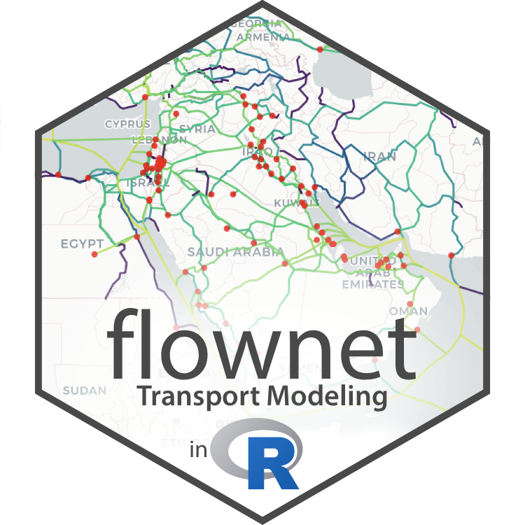

```{r setup, include=FALSE}
library(tibble)
knitr::opts_chunk$set(collapse = TRUE, 
  fig.width = 8, fig.height = 5, 
  out.width = '100%', cache = FALSE)

oldopts <- options(width = 150L, fastverse.styling = FALSE)
```



I am excited to introduce a new R package called [*flownet*](https://sebkrantz.github.io/flownet/) providing high-performance tools for transport modeling---network processing, route enumeration, and traffic assignment in R. As of now, the package implements the [Path-Sized Logit (PSL) model](https://sebkrantz.github.io/flownet/articles/introduction.html#path-sized-logit-model) (Ben-Akiva and Bierlaire, 1999)---a powerful and well-established method for stochastic traffic assignment accounting for route overlap---alongside a novel route enumeration algorithm and a highly efficient all-or-nothing assignment solution. Furthermore, *flownet* provides powerful utility functions for (multimodal) network processing, including recursive graph consolidation/contraction, and/or network simplification. These features, combined with an accessible representation of graphs and origin-destination (OD) matrices using data frames and a simple yet powerful API, position the package as a compelling alternative for both transport analytics and graph manipulation. 

As has come to be expected of my packages, *flownet* strives to be computationally efficient, building on a whole array of [*fastverse*](https://fastverse.org/fastverse/) libraries including [*collapse*](https://fastverse.org/collapse/) and [*kit*](https://fastverse.org/kit/) for fast data manipulation, [*igraph*](https://igraph.org/) for efficient routing, [*geodist*](https://hypertidy.github.io/geodist/) and [*leaderCluster*](https://CRAN.R-project.org/package=leaderCluster) for spatial distances and clustering, and [*mirai*](https://mirai.r-lib.org/) for efficient R-level parallelism. These dependencies are supplemented by custom C code, e.g., the PSL is implemented fully in C. There is still significant room for greater performance, particularly if *igraph* can be replaced with internal C/C++ routing code, which could port the entire route enumeration algorithm to C/C++. Such innovation may be the subject of future updates, alongside additional traffic assignment methods. 

The package supports directed and undirected graphs and multimodal networks.^[Multimodality is principally supported via `by` arguments to network processing functions. Passing link-mode identifiers to this argument prevents network simplification/contraction across different modes.] In the following I will, however, demonstrate *flownet* on two unimodal networks. 

The first is the African continental road network built in my [Job Market Paper](https://sebastiankrantz.com/research.html#optimal-african-roads) and included in the package. This network is already consolidated and has 1379 nodes and 2344 edges representing 315,000 km of African road network. It is thus a rather small network as far as the capabilities of *flownet* are concerned. 

The second network is the [US Freight Analysis Framework (FAF5) network](https://ops.fhwa.dot.gov/freight/freight_analysis/faf/) comprising 487,394 edges and 348,495 nodes. This network is too large, at least for the PSL method, to yield a solution within a reasonable time, and will require some network simplification first.

## Example 1: Africa's Road Network

The `africa_network`, taken from Krantz (2024) [Optimal Investments in Africa's Road Network](https://doi.org/10.1596/1813-9450-10893) is included in the package. It was generated by intersecting and simplifying fastest OSRM car routes between 453 African cities with population > 100,000 and international ports---provided in `africa_cities_ports`. The procedure of creating this network is described in the paper, and further demonstrated in the [introductory vignette](https://sebkrantz.github.io/flownet/articles/introduction.html#advanced-workflow-with-network-consolidation) using the network processing tools this package provides. For this blog post we will take the network as given and defer the network processing workflow to the second (FAF5) example below. 

The network includes 481 proposed new links found using a network finding algorithm described in the paper. The following code shows a plot of the network, including the proposed links in grey and the 453 (port-)cities in black.

```{r}
library(fastverse)
fastverse_extend(flownet, sf, tmap)

# Plot network colored by travel speed
tm_basemap("CartoDB.Positron", zoom = 4) +
tm_shape(africa_network) +
  tm_lines(col = "speed_kmh",
           col.scale = tm_scale_continuous(values = "turbo", 
                                           values.range = c(0.1, 0.9), 
                                           value.na = "grey"),
           col.legend = tm_legend("Speed (km/h)", position = c("left", "bottom"),
                                  frame = FALSE, text.size = 0.8, title.size = 1, 
                                  item.height = 2, na.show = FALSE), lwd = 1.5) +
tm_shape(africa_cities_ports) + tm_dots(size = 0.1) +
tm_layout(frame = FALSE)
```

Evidently, the OSRM travel speed along links differs widely, with speeds along many central African roads around 40km/h, and higher speeds closer to the urban centers. The code below further describes the network after removing the proposed links. As detailed in Section 3 of the paper, I extracted border and documentary times and costs of exporting and importing from the last World Bank Doing Business Survey (data collected in 2019), and converted them to travel-time-equivalent frictions (in minutes) that apply along border-crossing links. There is thus a frictionless `duration` (pure travel time) variable and `border_time` (which includes documentary time---median 76h), which added together give the `total_time` needed to trade across a link. 

```{r}
# Removing potential new links
africa_net <- fsubset(africa_network, !add, -add)
names(africa_net) |> cat(sep = ", ")
qsu(africa_net, cols = .c(from, to, speed_kmh, distance, duration, border_time, total_time))
```

The package also provides, in `africa_trade`, a dataset of bilateral trade flows between the 47 countries which accommodate (port-)city centroids. It is derived from the [CEPII BACI database](https://www.cepii.fr/CEPII/en/bdd_modele/bdd_modele_item.asp?id=37), HS96 version, averaged over 2012-2022 by 21 HS sections.

```{r}
# Convert to tibble for compact printing of section names
qTBL(africa_trade)
```

Our exercise will be to assign these trade flows, in particular the `quantity` in metric tons, to the network. While certainly not all intra-African trade travels by road, [UNECA 2022](https://www.uneca.org/the-african-continental-free-trade-area-and-demand-for-transport-infrastructure-and-services) estimate that in the 2019 baseline 76.7% of intra-African freight traveled by road, followed by 22.1% maritime, 0.9% air, and only 0.3% by rail. Thus, focusing on the road network alone is not a horrible simplification. For simplicity, we will aggregate the trade data across sections and consider assignments with and without the proposed links and trade frictions. 

```{r}
# Aggregating the trade data across HS sections
trade_agg <- africa_trade |> 
  collap(quantity ~ iso3_o + iso3_d, fsum)
```

The Africa network is already in a graph format with `from` and `to` node columns. Thus, all we need to do here to get the representation *flownet* expects is drop the geometry. Next, we need to map the (port-)city locations to the nearest network nodes:

```{r}
# Convert to graph
graph <- st_drop_geometry(africa_net)

# Extract nodes with spatial coordinates
nodes <- nodes_from_graph(graph, sf = TRUE)
head(nodes, 3)

# Map cities/ports to nearest nodes
nearest_nodes <- nodes$node[st_nearest_feature(africa_cities_ports, nodes)]
```

To construct an origin-destination matrix suitable for assignment to this network, we need to disaggregate the country-level trade flows using (port-)city population shares. The code below demonstrates this procedure, resulting in an OD matrix with columns `from`, `to`, and `flow` (in metric tons) at the (port-)city level.

```{r}
# Compute each city's share of its country's population
city_pop <- st_drop_geometry(africa_cities_ports) |>
  fcompute(node = nearest_nodes, city = qF(city_country),
           pop_share = fsum(population, iso3, TRA = "/"), keep = "iso3")
head(city_pop, 3)

# Join with city population shares for origin and destination
# add_stub adds suffix to all columns, so iso3 -> iso3_o matches trade_agg$iso3_o
od_matrix_trade <- trade_agg |>
  join(city_pop |> add_stub("_o", FALSE), multiple = TRUE) |>
  join(city_pop |> add_stub("_d", FALSE), multiple = TRUE) |>
  fmutate(flow = quantity * pop_share_o * pop_share_d) |>
  frename(from = node_o, to = node_d) |>
  fsubset(flow > 0 & from != to)

head(od_matrix_trade, 3)
```

We are now ready to run the traffic assignment with the [PSL model](https://sebkrantz.github.io/flownet/articles/introduction.html#path-sized-logit-model), which is straightforward with `run_assignment()`. To increase performance, we use parallel processing by setting `nthreads = 8` to use 8 cores on this M4 Pro chip. R-level parallelism using *mirai* is highly efficient, but requires additional memory. In this example we also save all intermediate results, including individual path alternatives and associated probabilities, by setting `return.extra = "all"`. This can get very memory-intensive, especially if there are many plausible paths per OD pair. Thus, we limit the number of paths per OD-pair to 150 by setting `npaths.max = 150`. Another crucial step for PSL modelling is data harmonization. Multinomial logits, of which the PSL is a penalized variant, do not deal well with very large path-cost numbers. Thus, mean or median scaling of the generalized cost (dividing all data points by the mean or median) is good practice. We will later also need to calibrate the PSL parameter `beta` (default 1) to achieve the desired level of penalization of overlapping paths. But first, we conduct a basic dry run of the model and explore the outputs. 

```{r}
# Median scaling cost column: recommended for PSL
settfm(graph, duration_ms = fmedian(duration, TRA = "/"))
# Run Traffic Assignment using the PSL model
result <- run_assignment(graph, od_matrix_trade, cost.column = "duration_ms", 
                         nthreads = 8, npaths.max = 150, return.extra = "all")
print(result)
```

It should be noted here, that processing OD-pairs at a rate of around 6000 per second is quite fast, given that on average 80 alternative paths are generated per OD-pair---which means we are generating `6000 * 80 = 480,000` or almost half a million paths per second. Overall, we just generated 15 million paths, yielding a results object more than 5Gb in size. 

```{r}
str(result, max.level = 1)         # Overiew of results objects
format(object.size(result), "Mb")  # Object size
sum(vlengths(result$paths))        # Total Number of paths
Qprobs <- c(0, 0.01, 0.05, 0.1, 0.25, 0.5, 0.75, 0.9, 0.95, 0.99, 1)
quantile(vlengths(result$paths), Qprobs) # Number of paths distribution
```

The default, `return.extra = NULL`, would have only returned the final flows vector equal in length to the number of edges (2344). In general, `return.extra = "paths"`, responsible for the biggest memory bloat (the object without `"paths"` is only 1.5 GB), is hardly ever needed.

The printout above shows, among other things, the average degree of overlap between paths in terms of visits per edge, computed as `mean(fmean(result$edge_counts)) = 7.87`, and the average adjusted path probability as `mean(fmean(result$path_weights)) = 0.024`. We could use this information to visualize the paths and their probabilities for a specific OD-pair. Let's take an iconic Cape Town to Cairo routing example: 

```{r}
# See which OD-pair is cape town to cairo
c2c <- od_matrix_trade |> 
  with(which(city_o %like% "Cape Town" & city_d %like% "Cairo"))
od_matrix_trade[c2c, ]
# In this case all OD-pairs are used, otherwise need to adjust 
length(result$od_pairs_used) == nrow(od_matrix_trade)
# Get paths, probabilities for Cape Town to Cairo
cost <- graph$duration_ms
c2c_paths <- result$paths[[c2c]]
c2c_edges <- result$edges[[c2c]] # !! C to R Bug: in versions <= 0.1.2 need to subtract 1 !!
c2c_ecounts <- result$edge_counts[[c2c]]
c2c_eweights <- result$edge_weights[[c2c]]
c2c_pcosts <- result$path_costs[[c2c]]
length(c2c_pweights <- result$path_weights[[c2c]])
```

Let's start by running a number of tests to see that the software computes the path probabilities and costs correctly. The path cost is computed as the sum of link costs along the path. 

```{r}
all.equal(c2c_pcosts, fsum(lapply(c2c_paths, \(x) cost[x]))) # Test path cost computation
```

The path probabilities are computed using the sum of the log-PSL terms (which account for path overlap) and the negative path cost. The code below tests that these computations are correct, and also shows how to compute the PSL terms from the paths, costs, and edge counts.

```{r}
# Compute PSL terms
PSL <- sapply(c2c_paths, \(x) sum(cost[x] / c2c_ecounts[match(x, c2c_edges)])) / c2c_pcosts
quantile(c2c_pcosts, Qprobs)
quantile(PSL, Qprobs)
quantile(log(PSL), Qprobs)
quantile(log(PSL) / -c2c_pcosts, Qprobs) # Adjustment amount with default beta = 1
```

The quantiles show that the log(PSL) term ranges between -3.72 and -1.1, whereas the cost is between 80.7 and 121, which yields a median ratio of 2.3%. This is likely too weak of a corrective effect, practitioners usually aim for the PSL penalty to represent roughly 10% to 20% of the utility for heavily overlapped paths. This should approximately be the case when setting `beta = 5`:

```{r}
quantile(5*log(PSL) / -c2c_pcosts, Qprobs)
```

Thus, we will need to re-estimate the model with this value of `beta`. However, before doing so, let's test that the software computes the path probabilities correctly.

```{r}
# Test that software computes probabilities correctly (beta = 1)
all.equal(proportions(exp(-c2c_pcosts + log(PSL))) , c2c_weights) 
```

Now let's run the calibrated model, omitting paths return and not restricting the number of paths this time.

```{r}
# Run Traffic Assignment using the calibrated PSL model - omitting paths this time to save memory
result <- run_assignment(graph, od_matrix_trade, cost.column = "duration_ms", beta = 5, nthreads = 8,
                         return.extra = c("edges", "counts", "costs", "weights", "eweights"))
print(result)
```

And now let's look again at the Cape Town to Cairo routes

```{r}
c2c_edges <- result$edges[[c2c]] # !! C to R Bug: in versions <= 0.1.2 need to subtract 1 !!
c2c_ecounts <- result$edge_counts[[c2c]]
c2c_pcosts <- result$path_costs[[c2c]]
c2c_eweights <- result$edge_weights[[c2c]]
quantile(c2c_weights <- result$path_weights[[c2c]], Qprobs) |> round(4)
```

We can plot the paths in various ways. Let's start by visualizing the edge counts: 

```{r}
africa_net$c2c_ecounts[c2c_edges] <- c2c_ecounts
tm_basemap("CartoDB.Positron", zoom = 4) +
tm_shape(africa_net) +
  tm_lines(col = "c2c_ecounts",
           col.scale = tm_scale_continuous(values = "turbo", 
                                           values.range = c(0.1, 0.9), 
                                           value.na = "grey"),
           col.legend = tm_legend("Edge Visits", position = c("left", "bottom"),
                                  frame = FALSE, text.size = 0.8, title.size = 1, 
                                  item.height = 2, na.show = FALSE), lwd = 1.5) +
tm_shape(africa_cities_ports) + tm_dots(size = 0.1) +
tm_layout(frame = FALSE)
```

As this plot makes evident, by virtue of the various edge-level statistics `run_assignment()` can return, it is not necessary to retain the full paths to fully understand the model. 

Now, let's also plot the probabilities. The `edge_weights` returned by the model represent the sum of path probabilities over all paths using each edge. Thus, in the context of probabilistic assignment, they can be interpreted as the proportion of C2C trade that traverses the edge. For additional clarity, let's plot only those edges where the probability is above 0.0001.

```{r}
africa_net$c2c_eweights <- NA
africa_net$c2c_eweights[c2c_edges[c2c_eweights > 0.0001]] <- c2c_eweights[c2c_eweights > 0.0001]
tm_basemap("CartoDB.Positron", zoom = 4) +
tm_shape(africa_net) +
  tm_lines(col = "c2c_eweights",
           col.scale = tm_scale_continuous(values = "turbo", 
                                           values.range = c(0.1, 0.9), 
                                           value.na = "grey"),
           col.legend = tm_legend("Edge Probabilities", position = c("left", "bottom"),
                                  frame = FALSE, text.size = 0.8, title.size = 1, 
                                  item.height = 2, na.show = FALSE), lwd = 1.5) +
tm_shape(africa_cities_ports) + tm_dots(size = 0.1) +
tm_layout(frame = FALSE)
```

Clearly, and in contrast to what the edge counts from the raw routes suggested, no meaningful C2C traffic is routed through central Africa or the Sahara.

The model thus seems well-behaved, and we can plot the final flows on the entire network:

```{r}
africa_net$final_flows <- result$final_flows
tm_basemap("CartoDB.Positron", zoom = 4) +
tm_shape(africa_net) +
  tm_lines(col = "final_flows",
           col.scale = tm_scale_continuous_sqrt(values = "turbo", 
                                           values.range = c(0.1, 0.9), 
                                           value.na = "grey"),
           col.legend = tm_legend("Frictionless Flows", position = c("left", "bottom"),
                                  frame = FALSE, text.size = 0.8, title.size = 1, 
                                  item.height = 2, na.show = FALSE), lwd = 1.5) +
tm_shape(africa_cities_ports) + tm_dots(size = 0.1) +
tm_layout(frame = FALSE)
```

Evidently, certain trade routes are much more utilized than others. But this, of course, assumes the frictionless scenario. Let's now see how the picture changes with the realistic trade costs added: 

```{r}
# Median scaling cost column: recommended for PSL
settfm(graph, total_time_ms = fmedian(total_time, TRA = "/"))
# Run Traffic Assignment using the PSL model
result_tc <- run_assignment(graph, od_matrix_trade, cost.column = "total_time_ms", 
                            beta = 5, nthreads = 8)
print(result_tc)
```

```{r}
africa_net$final_flows_tc <- result_tc$final_flows
tm_basemap("CartoDB.Positron", zoom = 4) +
tm_shape(africa_net) +
  tm_lines(col = "final_flows_tc",
           col.scale = tm_scale_continuous_sqrt(values = "turbo", 
                                           values.range = c(0.1, 0.9), 
                                           value.na = "grey"),
           col.legend = tm_legend("Flows under Frictions", position = c("left", "bottom"),
                                  frame = FALSE, text.size = 0.8, title.size = 1, 
                                  item.height = 2, na.show = FALSE), lwd = 1.5) +
tm_shape(africa_cities_ports) + tm_dots(size = 0.1) +
tm_layout(frame = FALSE)
```

The result is quite fascinating as it suggests that, if the Doing Business 2019 Trade Frictions are accurate and traders are rational, these frictions could strongly distort intra-African trade patterns from the efficient equilibrium determined by the quality of road infrastructure. 

On that note, what if the existing network were fully upgraded? If all roads had a minimum travel speed of 100km/h? The network includes a column `duration_100kmh` simulating just that. The median link under this scenario has a travel time of only 65% of the current travel time. 

```{r}
quantile(africa_net$duration_100kmh / africa_net$duration, Qprobs)
settfm(graph, duration_100kmh_ms = fmedian(duration_100kmh, TRA = "/"))
result_ug <- run_assignment(graph, od_matrix_trade, cost.column = "duration_100kmh_ms", 
                            beta = 5, nthreads = 8)
print(result_ug)
```
```{r}
africa_net$final_flows_ug <- result_ug$final_flows
tm_basemap("CartoDB.Positron", zoom = 4) +
tm_shape(africa_net) +
  tm_lines(col = "final_flows_ug",
           col.scale = tm_scale_continuous_sqrt(values = "turbo", 
                                           values.range = c(0.1, 0.9), 
                                           value.na = "grey"),
           col.legend = tm_legend("Flows: Upgraded", position = c("left", "bottom"),
                                  frame = FALSE, text.size = 0.8, title.size = 1, 
                                  item.height = 2, na.show = FALSE), lwd = 1.5) +
tm_shape(africa_cities_ports) + tm_dots(size = 0.1) +
tm_layout(frame = FALSE)
```

The plot appears similar to the previous frictionless plot, with a bit more traffic routed through central Africa and the Sahara where at present the road quality is very poor. But clearly, given the present low volume of trade between Eastern and Western Africa (less than 1% or total intra-African trade), paving roads in central Africa wouldn't pay off. Such investments thus appear to be contingent on the assumption or deliberate motive of changing regional trade patterns, or, as the [paper finds](https://sebastiankrantz.com/research.html#optimal-african-roads), on unrealistically low trade elasticities. 

Lastly, we can simulate flows on the network with the proposed links added, and see how much they are utilized. The links, although drawn as straight lines, are assumed to be 1.2 times longer than the line, which is the average across existing links when comparing them to a straight line:

```{r}
qDT(africa_network)[add == TRUE, quantile(distance / sp_distance)]
```

They are assumed to have a speed of 100km/h, so it makes sense to also assume the network was upgraded first. 

```{r}
graph_total <- st_drop_geometry(africa_network)
settfm(graph_total, duration_100kmh_ms = fmedian(duration_100kmh, TRA = "/"))
result_add <- run_assignment(graph_total, od_matrix_trade, cost.column = "duration_100kmh_ms", 
                            beta = 5, nthreads = 8)
print(result_add)
```
```{r}
africa_network$final_flows <- result_add$final_flows
tm_basemap("CartoDB.Positron", zoom = 4) +
tm_shape(africa_network) +
  tm_lines(col = "final_flows",
           col.scale = tm_scale_continuous_sqrt(values = "turbo", 
                                           values.range = c(0.1, 0.9), 
                                           value.na = "grey"),
           col.legend = tm_legend("Flows: Total", position = c("left", "bottom"),
                                  frame = FALSE, text.size = 0.8, title.size = 1, 
                                  item.height = 2, na.show = FALSE), lwd = 1.5) +
tm_shape(africa_cities_ports) + tm_dots(size = 0.1) +
tm_layout(frame = FALSE)
```

The results suggest that some national links, e.g., in Botswana, additional trans-Saharan links, and, notably, reopening the Morocco-Algeria border, could be utilized significantly. 

Finally, I should note again that all of this assumes intra-African trade patterns are static, which of course they are not, as infrastructure improvements can induce new trade flows.

## Example 2: US FAF5 Network


## Conclusion

[**flownet**](https://sebkrantz.github.io/flownet/) is a new R package for efficient transport modeling, including route enumeration and traffic assignment using the Path-Sized Logit model. It provides powerful tools for network processing and an accessible API, making it a compelling choice for transport analytics in R. The package is built on top of several *fastverse* libraries and custom C code to ensure high performance. In this post, I demonstrated the package on African and US road networks, showing how to assign trade flows and visualize the results. Future updates may include additional traffic assignment methods and further performance optimizations.
